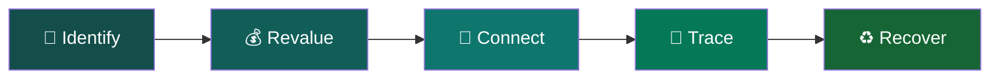

**Repository Notice**

This repository is public for the purpose of Smart India Hackathon 2026 evaluation only. All code, designs, and content in this repository are the original work of Team AURONYXXX and are provided here solely so that SIH judges and mentors can review the prototype and its version history.

© 2026 Team AURONYXXX. All rights reserved. This code may not be copied, redistributed, or used for any purpose without the express written permission of Team AURONYXXX.
<!-- ANIMATED HERO -->

  

  

  <b>♻️ Revalue the Waste. Reconnect the Chain.</b>

  
  
  

---

## 🌿 The Vision

Waste doesn't lose its value. It loses its way back.

REVARTA connects informal scrap collectors with the formal e-waste recycling ecosystem through intelligent material identification, estimated valuation, recycler discovery, and digital traceability.

### ✦ Why REVARTA?

**RE** — Renew. **VA** — Value. **ĀVARTA** — Cycle of return.

A name inspired by one mission: **give discarded resources a way back into the economy.**

---

## ✨ The Journey

  

| ♻️ Feature              | 💡 Purpose                                                 |
| ----------------------- | ---------------------------------------------------------- |
| 🤖 AI Identification    | Recognize supported e-waste categories from images.        |
| 💰 Smart Valuation      | Estimate material value using weight and pricing data.     |
| 📍 Recycler Discovery   | Find suitable recycling partners by location and material. |
| 📄 Digital Handover     | Maintain traceable records of material transfers.          |
| 📊 Earnings Ledger      | Organize collection quantities and transaction history.    |
| 🧠 Intelligent Matching | Match material requirements with suitable recyclers.       |

*Feature availability depends on the current implementation.*

---

## 🔄 From Scrap to Resource

**Capture → Classify → Value → Connect → Recover**

---

## 🌍 Our Impact

* ♻️ **Circularity:** Help recover valuable materials from discarded electronics.
* 🤝 **Inclusion:** Connect informal collectors with formal recycling channels.
* 🔎 **Transparency:** Improve access to indicative prices and recycler information.
* 📑 **Traceability:** Support consistent digital handover records.
* 🌱 **Sustainability:** Encourage responsible e-waste recovery.

---
## 🗺️ Future Scope

  

  <b>♻️ EXPANDING THE CIRCULAR ECONOMY</b>
   
  Ideas for making waste recovery more accessible, intelligent, and transparent.

<table>
  <tr>
    <td width="50%" valign="top">

### 🟢 01 · Vernacular AI

**Voice for Everyone**

Enable regional-language voice assistance to make essential recovery workflows easier for local collectors and kabadiwalas.

 

### 🟢 02 · Offline-First Access

**Connectivity Without Barriers**

Allow collection records to be saved offline and synchronized automatically when connectivity returns.

 

### 🟢 03 · Advanced AI Recognition

**Smarter Waste Identification**

Explore broader classification of electronic components and mixed-material waste through improved image recognition.

 

### 🟢 04 · Intelligent Valuation

**Understand Material Value**

Investigate location-aware pricing insights and material-specific value trends using reliable market data.

</td>
<td width="50%" valign="top">

### 🟢 05 · Smart Collection Routes

**Move More Efficiently**

Explore pickup-route optimization to reduce unnecessary travel, fuel consumption, and collection costs.

 

### 🟢 06 · Verified Recycler Network

**Trust Through Verification**

Integrate reliable official sources to help users check recycler authorization and eligibility.

 

### 🟢 07 · Digital Impact Analytics

**Make Recovery Measurable**

Create reports showing recorded material recovery, documented handovers, and collection activity.

 

### 🟢 08 · Circular Economy Insights

**Turn Data Into Direction**

Analyze reliable transaction data to identify bottlenecks and opportunities across the collection-to-recycling journey.

</td>
  </tr>
</table>

  

  <i>“Every recovered resource is another opportunity to renew its value.”</i>

Note: These are proposed future enhancements. Their implementation will depend on data availability, technical feasibility, regulatory requirements, and validation in real-world conditions.

💚 Our Vision

REVARTA is built around the belief that a more circular resource economy begins with better connections.

A scrap collector should be able to identify a material, understand its potential value, discover an appropriate recycling channel, and maintain a record of the handover without navigating a fragmented process.

By connecting people, materials, information, and formal recycling pathways, REVARTA seeks to help waste find its way back.

 <strong>REVARTA — Waste Finds Its Way Back.</strong>   Revalue what remains. Reconnect the chain. Return resources to use. 

